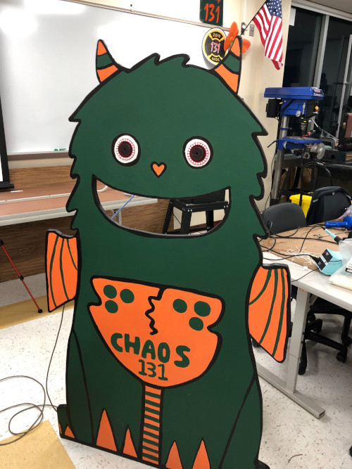
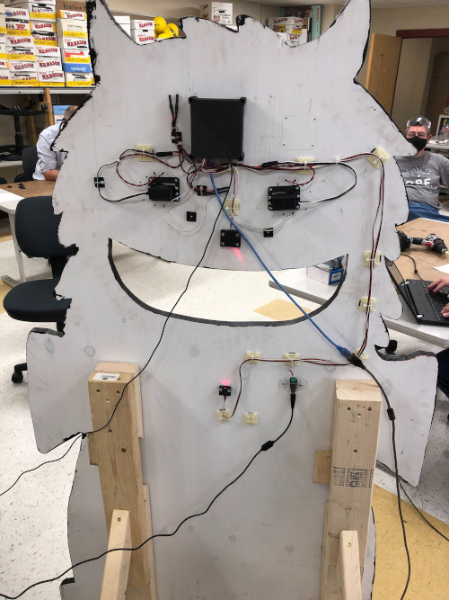

# Cereal Monster

Sourcecode for a robot that eats cereal boxes

 

## Hardware

 - Arduino Uno
 - 2 x NeoPixel Ring - 24 x 5050 RGB LED (Adafruit P1586)
 - "Music Maker" MP3 Shield for Arduino (Adafruit P1788)
 - MicroSD card
 - Photo cell (CdS photoresistor) (Adafruit P161)
 - Laser Diode - 5mW 650nm Red (Adafruit P1054)
 - 2 x Smart Robot Servo (REV Robotics REV-41-1097)

## Wiring

| Pin | Purpose |
| --- | --- |
| Digital 0 | Serial RX |
| Digital 1 | Serial TX |
| Digital 2 |  |
| Digital 3~ | Music Maker shield - "DREQ" Interrupt |
| Digital 4 | Music Maker shield - SD Card "CCS" SPI chip select |
| Digital 5~ | Servo - Right Eye |
| Digital 6~ | Music Maker shield - VS1053 "DCS" Data select|
| Digital 7 | Music Maker shield - VS1053 "MCS" chip select|
| Digital 8 |  |
| Digital 9~ | NeoPixel Ring Data Out |
| Digital 10~ | Servo - Left Eye |
| Digital 11~ | SPI MOSI - Music Maker shield |
| Digital 12 | SPI MISO - Music Maker shield |
| Digital 13 | SPI CLK - Music Maker shield |
| Analog 0 | Light sensor In |
| Analog 1 |  |
| Analog 2 |  |
| Analog 3 |  |
| Analog 4 |  |
| Analog 5 |  |

## Arduino Libraries

 - "Adafruit NeoPixel"
 - "Adafruit VS1053 Library" (for Music Maker Shield)

